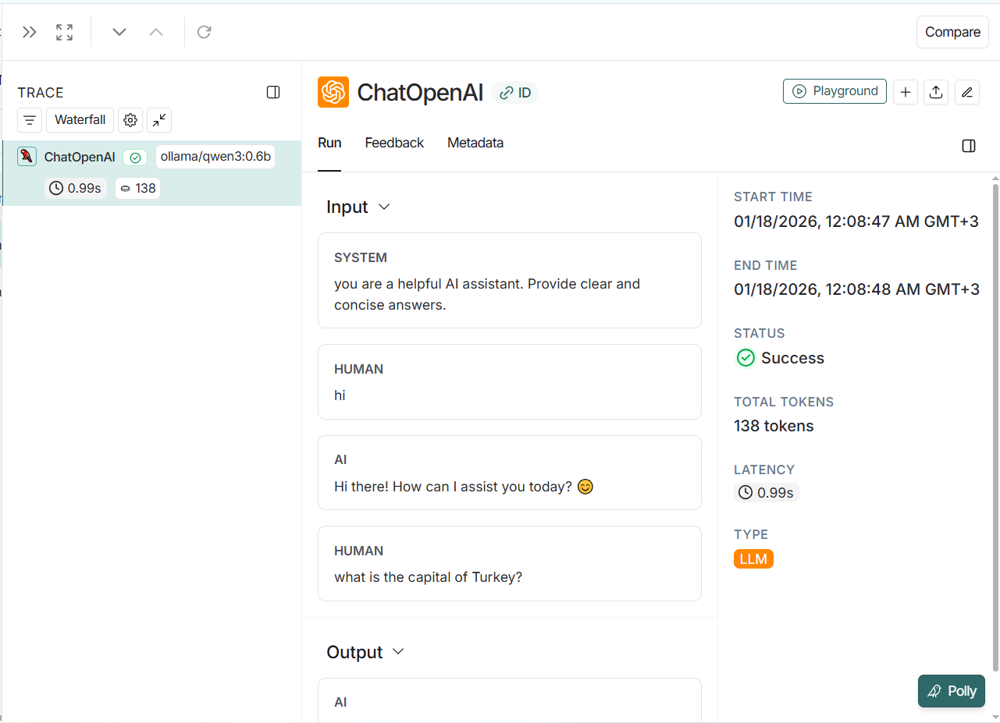

# Chat Uygulamasi

Yerel LLM (Ollama) kullanarak calisan bir sohbet uygulamasi. Verileriniz kendi sunucunuzda kalir.

## Mimari

```
┌─────────────────┐     ┌─────────────────┐     ┌─────────────────┐
│    Frontend     │────>│    Backend      │────>│   PostgreSQL    │
│   (React)       │     │   (FastAPI)     │     │   (Database)    │
│   :5173         │     │   :8000         │     │   :5432         │
└─────────────────┘     └─────────────────┘     └─────────────────┘
                               │
                               v
                        ┌─────────────────┐     ┌─────────────────┐
                        │    LiteLLM      │────>│     Ollama      │
                        │   (Gateway)     │     │   (Qwen3:0.6b)  │
                        │   :8023         │     │   :11434        │
                        └─────────────────┘     └─────────────────┘
```

## Onemli Notlar

- **Ollama** arka planda acik olmali (`ollama serve`)
- **LiteLLM** ayri bir Docker container olarak calisiyor
- **Frontend, Backend ve PostgreSQL** ayni docker-compose ile kalkiyor

## LiteLLM Neden Kullaniliyor?

LiteLLM, Ollama ile uygulama arasinda bir gateway gorevi goruyor:
- Modele atilan isteklerin **loglarini** gorebiliyorsun
- **Kullanim oranini** takip edebiliyorsun
- Modeli **izleyebiliyorsun**

Gözlemlenebilirlik (LangSmith)

Bu projede LangSmith entegrasyonu bulunmaktadır.

Backend (FastAPI) üzerinden yapılan LLM çağrıları trace edilir

Prompt–response akışı adım adım izlenebilir

Gecikme (latency) ve hata analizi yapılabilir

Prompt debugging ve iyileştirme süreci kolaylaşır

LiteLLM altyapı ve kullanım metriklerini sağlarken, LangSmith uygulama ve prompt seviyesinde gözlemlenebilirlik sunar.

Bu sayede lokal Ollama modeli ile çalışan sistem uçtan uca izlenebilir hale gelir.
## Ekran Goruntuleri


### Chat Arayuzu


## LangSmith



