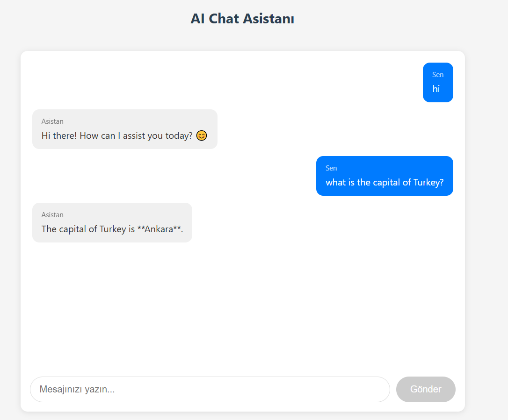
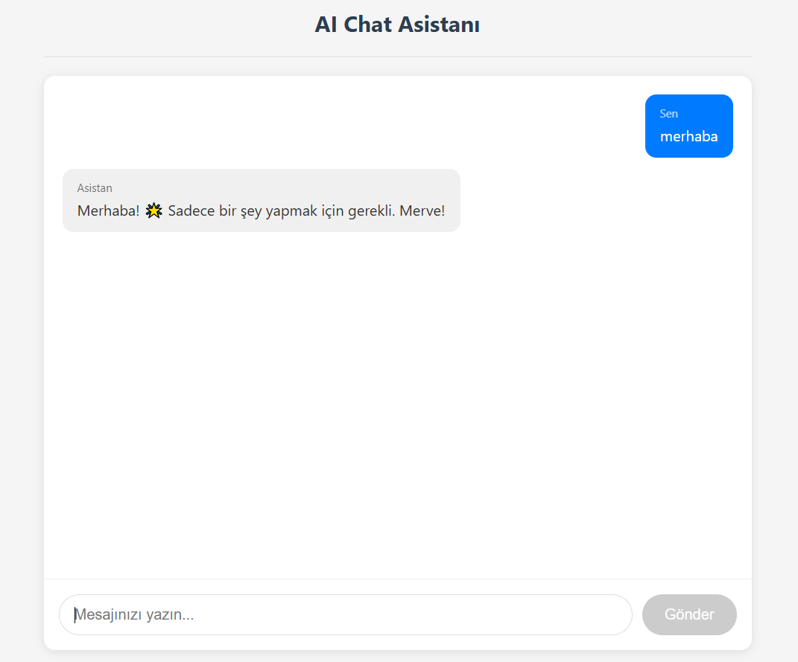

# Chat Uygulamasi

Yerel LLM (Ollama) kullanarak calisan bir sohbet uygulamasi. Verileriniz kendi sunucunuzda kalir.

## Mimari

```
┌─────────────────┐     ┌─────────────────┐     ┌─────────────────┐
│    Frontend     │────>│    Backend      │────>│   PostgreSQL    │
│   (React)       │     │   (FastAPI)     │     │   (Database)    │
│   :5173         │     │   :8000         │     │   :5432         │
└─────────────────┘     └─────────────────┘     └─────────────────┘
                               │
                               v
                        ┌─────────────────┐     ┌─────────────────┐
                        │    LiteLLM      │────>│     Ollama      │
                        │   (Gateway)     │     │   (Qwen3:0.6b)  │
                        │   :8023         │     │   :11434        │
                        └─────────────────┘     └─────────────────┘
```

## Onemli Notlar

- **Ollama** arka planda acik olmali (`ollama serve`)
- **LiteLLM** ayri bir Docker container olarak calisiyor
- **Frontend, Backend ve PostgreSQL** ayni docker-compose ile kalkiyor

## LiteLLM Neden Kullaniliyor?

LiteLLM, Ollama ile uygulama arasinda bir gateway gorevi goruyor:
- Modele atilan isteklerin **loglarini** gorebiliyorsun
- **Kullanim oranini** takip edebiliyorsun
- Modeli **izleyebiliyorsun**


## Ekran Goruntuleri

### LiteLLM Dashboards


### Chat Arayuzu

